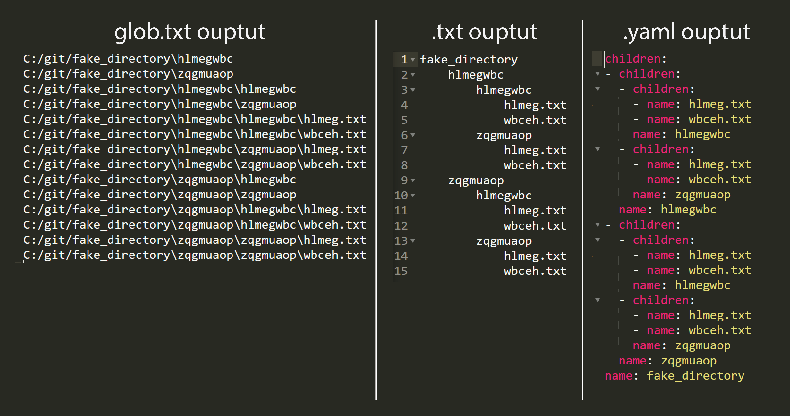

# Directory Tree Manager

exploratree is a Python program that allows you to save, search, and export directory tree structures. It provides functionality to store directory hierarchies, search for specific directories or files, and export the directory tree in different formats.

## Features

- **Save Directory Tree:** The program can save the directory tree structure of a given directory to preserve the hierarchy and file information.

- **Search Functionality:** You can search for specific directories or files within the saved directory tree structure based on search criteria such as file name, directory name, or file extension.

- **Export Directory Tree:** The program offers the ability to export the saved directory tree in various formats, including text file, YAML, or any other custom format.

## Installation

1. Clone the repository to your local machine:
   - `conda env create -f environment.yaml`
   - `conda activate exploratoryTree`
   - `pip install -e .` alternativeley `pip install .`

2. Notes:
   - The directory will not be added to the environment variables path so for the program to run come back to cloned/downloaded repository

## Usage

Within the directory run the following command can be run:
   - `exploratree-fakeDir`: generate a fake directory to test the program out
   - `exploratree-get`: output 3 files within an ouput folder
      - yaml: useful for searching and parsing the tree
      - glob.txt: retain all the full path of every file
      - txt: when used with sublime text [here](https://www.sublimetext.com/) can collapse and navigate like in any explorer
   - `exploratree-search`: browse the directory for specific key words and retrieve the full path

1. **`exploratree-fakeDir`:**
   - Choose the desired export format, such as text file or YAML.
   - The program will generate the export file containing the directory tree structure.

2. **`exploratree-get`:**
   - Run the program and provide the path of the directory you want to save.
   - The program will analyze the directory and store its tree structure for future use.
   - The program will generate the export files containing the directory tree structure in a folder within the parent directory of the one of interest with the 3 file formats.

3. **`exploratree-search`:**
   - Use the search functionality to find specific directories or files within the saved tree structure.
   - Specify search criteria such as file name, directory name, or file extension.
   - The program will display the results, providing the path to the matching directories or files.

## Output directory formats

## Notes

In the future it may be worthwile putting a md file with keyworkds 
and metada that may help the search etc.